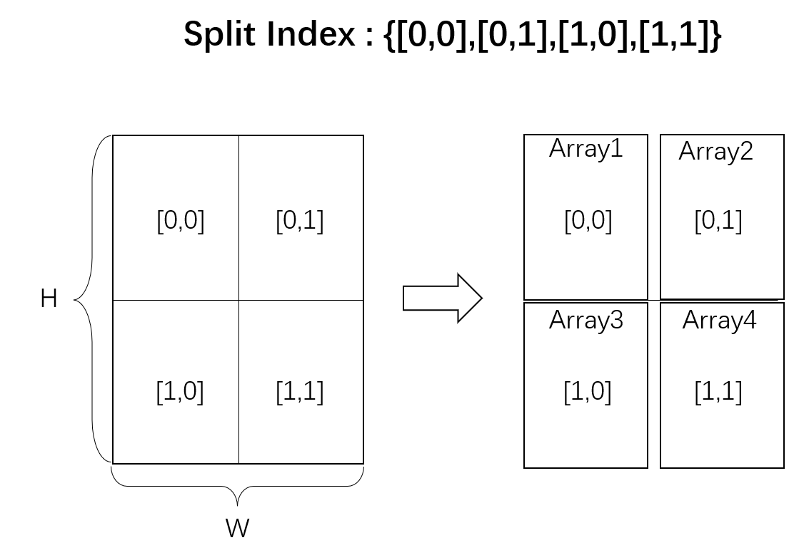

# Compute-In-Memory OPERATOR LIST

- <a href="#Convolution">Convolution</a>
- <a href="#MatMul">MatMul</a>

## <a name="Convolution">**Convolution**</a>

  The convolution operator consumes an input tensor and a filter, and
  computes the output.

### Version

`ONNX version`: `11`. 

`CIM version`: `1`.

### ONNX Attributes

<dl>
<dt><tt>auto_pad</tt> : string (default is NOTSET)</dt>
<dd>auto_pad must be either NOTSET, SAME_UPPER, SAME_LOWER or VALID. Where default value is NOTSET, which means explicit padding is used. SAME_UPPER or SAME_LOWER mean pad the input so that the output spatial size match the input.In case of odd number add the extra padding at the end for SAME_UPPER and at the beginning for SAME_LOWER. VALID mean no padding.</dd>
<dt><tt>dilations</tt> : list of ints</dt>
<dd>dilation value along each spatial axis of the filter. If not present, the dilation defaults is 1 along each spatial axis.</dd>
<dt><tt>group</tt> : int (default is 1)</dt>
<dd>number of groups input channels and output channels are divided into.</dd>
<dt><tt>kernel_shape</tt> : list of ints</dt>
<dd>The shape of the convolution kernel. If not present, should be inferred from input W.</dd>
<dt><tt>pads</tt> : list of ints</dt>
<dd>Padding for the beginning and ending along each spatial axis, it can take any value greater than or equal to 0. The value represent the number of pixels added to the beginning and end part of the corresponding axis. `pads` format should be as follow [x1_begin, x2_begin...x1_end, x2_end,...], where xi_begin the number of pixels added at the beginning of axis `i` and xi_end, the number of pixels added at the end of axis `i`. This attribute cannot be used simultaneously with auto_pad attribute. If not present, the padding defaults to 0 along start and end of each spatial axis.</dd>
<dt><tt>strides</tt> : list of ints</dt>
<dd>Stride along each spatial axis. If not present, the stride defaults is 1 along each spatial axis.</dd>
</dl>

### CIM Attributes

<dl>
<dt><tt>Location Address</tt> : list of ints(default is 0)</dt>
<dd>Location address is a list of number to describe the operator's location in current architecture( simulator or realistic hardware).This decription of RRAM macro chip can be a list of four int numbers [start_row, start_column, row_numbers, column_numbers].This description of RRAM full chip is not defined.If the value is default(0), it represents that current operator is mapped on the host device, which can be calculated by cpu or gpu. This value can be a list of lists[[start_row_1, start_column_1, row_numbers_1, column_numbers_1],...,[start_row_N, start_column_N, row_numbers_N, column_numbers_N]], which represents that this operator is mapped on different loction in different arrays.</dd>
<dt><tt>Split Index</tt> : list of ints(defaule is 0)</dt>
<dd>The split index aims to describe the current operators' position relative to the original postion after being split. The value can be a list of two int numbers, which is [row_relative_index, colunm_relative_index]. The Schematic diagram is shown as below.The defalut value represents that there is no splitting of current operator.This value can be a list of lists, which has the same number of lists of <tt>location address</tt> if current operator is not copied. 

	

 </dd>
<dt><tt>Copy Index</tt> : list of ints(defaule is 1)</dt>
<dd>The copy index aims to describe the current operators' copy location, which corresponds to the <tt>Location Address</tt>. So the length of list is the same with the number of the lists of <tt>Location Address</tt>. The default value is 1, which represents there is no copy for current operator. Note that each element in the list corresponds to one <tt>location address</tt>. So the order of elements in the list should correspond to the order of list of <tt>location address</tt>.
</dd> 
</dl>

### Inputs

<dl>
<dt><tt>X</tt> : T</dt>
<dd>Input data tensor from previous layer; has size (N x C x H x W), where N is the batch size, C is the number of channels, and H and W are the height and width. Note that this is for the 2D image. Otherwise the size is (N x C x D1 x D2 ... x Dn). Optionally, if dimension denotation is in effect, the operation expects input data tensor to arrive with the dimension denotation of [DATA_BATCH, DATA_CHANNEL, DATA_FEATURE, DATA_FEATURE ...].</dd>
<dt><tt>W</tt> : T</dt>
<dd>The weight tensor that will be used in the convolutions; has size (M x C/group x kH x kW), where C is the number of channels, and kH and kW are the height and width of the kernel, and M is the number of feature maps. For more than 2 dimensions, the kernel shape will be (M x C/group x k1 x k2 x ... x kn), where (k1 x k2 x ... kn) is the dimension of the kernel. Optionally, if dimension denotation is in effect, the operation expects the weight tensor to arrive with the dimension denotation of [FILTER_OUT_CHANNEL, FILTER_IN_CHANNEL, FILTER_SPATIAL, FILTER_SPATIAL ...]. X.shape[1] == (W.shape[1] * group) == C (assuming zero based indices for the shape array). Or in other words FILTER_IN_CHANNEL should be equal to DATA_CHANNEL. </dd>
<dt><tt>B</tt> (optional) : T</dt>
<dd>Optional 1D bias to be added to the convolution, has size of M.</dd>
</dl>

### Outputs

<dl>
<dt><tt>Y</tt> : T</dt>
<dd>Output data tensor that contains the result of the convolution. The output dimensions are functions of the kernel size, stride size, and pad lengths.</dd>
</dl>

### Type Constrains

<dl>
<dt><tt>ONNX Constrains</tt>:<tt>T</tt></dt>
<dd>tensor(float16), tensor(float), tensor(double)</dd>
<dd>Constrain input and output types to float tensors.</dd>
</dl>

<dl>
<dt><tt>CIM Constrains</tt>:<tt>T</tt></dt>
<dd>tensor(int8), tensor(float)</dd>
<dd>Constrain input and output types to int or float tensors when inferencing on chip or simulator.</dd>
</dl>

## <a name="MatMul">**MatMul**</a>

Matrix product that behaves like numpy.matmul: https://docs.scipy.org/doc/numpy-1.13.0/reference/generated/numpy.matmul.html

### Version

`ONNX version`: `13`. 

`CIM version`: `1`.

### CIM Attributes

<dl>
<dt><tt>Location Address</tt> : list of ints(default is 0)</dt>
<dd>Location address is a list of number to describe the operator's location in current architecture( simulator or realistic hardware).This decription of RRAM macro chip can be a list of four int numbers [start_row, start_column, row_numbers, column_numbers].This description of RRAM full chip is not defined.If the value is default(0), it represents that current operator is mapped on the host device, which can be calculated by cpu or gpu. This value can be a list of lists[[start_row_1, start_column_1, row_numbers_1, column_numbers_1],...,[start_row_N, start_column_N, row_numbers_N, column_numbers_N]], which represents that this operator is mapped on different loction in different arrays.</dd>
<dt><tt>Split Index</tt> : list of ints(defaule is 0)</dt>
<dd>The split index aims to describe the current operators' position relative to the original postion after being split. The value can be a list of two int numbers, which is [row_relative_index, colunm_relative_index]. The Schematic diagram is shown as below.The defalut value represents that there is no splitting of current operator.This value can be a list of lists, which has the same number of lists of <tt>location address</tt> if current operator is not copied. 

	

 </dd>
<dt><tt>Copy Index</tt> : list of ints(defaule is 1)</dt>
<dd>The copy index aims to describe the current operators' copy location, which corresponds to the <tt>Location Address</tt>. So the length of list is the same with the number of the lists of <tt>Location Address</tt>. The default value is 1, which represents there is no copy for current operator. Note that each element in the list corresponds to one <tt>location address</tt>. So the order of elements in the list should correspond to the order of list of <tt>location address</tt>.
</dd> 
</dl>

### Inputs

<dl>
<dt><tt>A</tt> : T</dt>
<dd>N-dimensional matrix A</dd>
<dt><tt>B</tt> : T</dt>
<dd>N-dimensional matrix B</dd>
</dl>

### Outputs

<dl>
<dt><tt>Y</tt> : T</dt>
<dd>Matrix multiply results from A * B</dd>
</dl>

### Type Constrains

<dl>
<dt><tt>ONNX Constrains</tt>:<tt>T</tt></dt>
<dd> tensor(float16), tensor(float), tensor(double), tensor(uint32), tensor(uint64), tensor(int32), tensor(int64)</dd>
<dd>Constrain input and output types to float/int tensors.</dd>
</dl>

<dl>
<dt><tt>CIM Constrains</tt>:<tt>T</tt></dt>
<dd>tensor(int8), tensor(float)</dd>
<dd>Constrain input and output types to int or float tensors when inferencing on chip or simulator.</dd>
</dl>